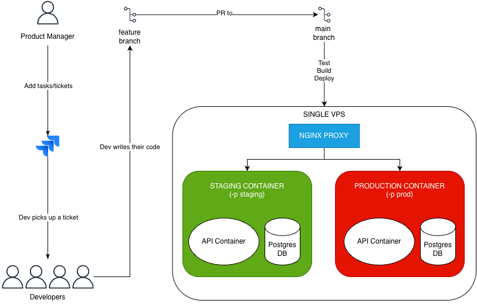

# Single-Server Deployment Workflow

## Overview

Due to budget constraints, we use a single VPS with Docker and Nginx to achieve logical environment isolation instead of separate physical servers.

- **Docker** runs a staging container and a production container on different ports.
- **Nginx** routes incoming traffic to the correct container based on subdomain.

This approach provides a professional, isolated workflow while keeping costs minimal.

---

## How It Works

### 1. GitHub Trigger

When code is pushed to the `main` branch, a GitHub Action wakes up and builds a single Docker image — the **source of truth**. The same image is deployed to both staging and production to guarantee consistency; you never want different builds running in each environment.

### 2. Nginx Traffic Controller

Nginx acts as the front-door router for the VPS:

| Request | Destination |
|---|---|
| `api.myapp.com` | Production container |
| `staging.api.myapp.com` | Staging container |

Both environments run on the same server without any awareness of each other.

### 3. Docker Project Isolation

Using the `-p` (project) flag in Docker Compose (e.g. `docker-compose -p staging up`) creates a separate virtual network per environment:

- The **Staging API** talks only to the **Staging DB**.
- The **Production API** talks only to the **Production DB**.

They share the same physical disk but are logically isolated — they cannot access each other's data.

### 4. Database Strategy

- **Initial setup:** Two separate database containers are created — one for staging, one for production.
- **Schema updates:** When a feature requires a database change, the API container runs migrations against its own database on startup (e.g. `python manage.py migrate`).
- **Prod sync:** To keep staging representative of production, a script can periodically copy data from the production container to the staging container.
