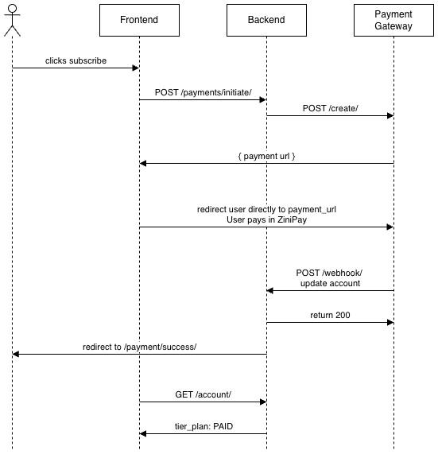

# Payment Flow

Freshr uses [ZiniPay](https://zinipay.com) as its payment gateway. Subscriptions are managed manually — ZiniPay handles the one-time transaction, and the backend activates the subscription upon receiving a successful webhook notification.

---

## Subscription Plans

| Plan    | Tier | Billing Interval | Duration   |
| ------- | ---- | ---------------- | ---------- |
| Free    | FREE | —                | Indefinite |
| Monthly | PAID | MONTHLY          | 30 days    |
| Yearly  | PAID | YEARLY           | 365 days   |

Prices are configured via environment variables:

```
ZINIPAY_MONTHLY_PRICE=9.99
ZINIPAY_YEARLY_PRICE=99.99
```

---

## Account Subscription Fields

The `Account` model tracks the following subscription-related fields. These are **read-only** via the API — they can only be updated by the webhook handler or Django admin.

| Field                     | Description                                     |
| ------------------------- | ----------------------------------------------- |
| `tier_plan`               | `FREE` or `PAID`                                |
| `billing_interval`        | `MONTHLY`, `YEARLY`, or `null` for free users   |
| `subscription_status`     | `ACTIVE`, `INACTIVE`, `CANCELLED`, or `EXPIRED` |
| `subscription_start_date` | Timestamp of the most recent successful payment |
| `subscription_end_date`   | When the current subscription period ends       |

---

## Payment Flow



### Step 1 — Frontend initiates payment

```
POST /payments/initiate/
Authorization: Bearer <token>
Content-Type: application/json

{ "billing_interval": "MONTHLY" }
```

The backend:

1. Creates a `Payment` record with `status=PENDING`
2. Calls the ZiniPay API with the amount, redirect URLs, webhook URL, and `payment_id` in metadata
3. Returns the hosted payment URL to the frontend

```json
{ "payment_url": "https://secure.zinipay.com/payment/abc123xyz" }
```

### Step 2 — User completes payment on ZiniPay

The user is redirected to ZiniPay's hosted page. Your backend is not involved at this stage.

### Step 3 — ZiniPay calls the webhook

```
POST /payments/webhook/
Content-Type: application/json
```

Example payload for a successful payment:

```json
{
  "status": "COMPLETED",
  "transaction_id": "OVKPXW135414",
  "invoiceId": "553ca0ac-28c0-41f7-adc0-6243910b1e1b",
  "amount": "9.99",
  "currency": "USD",
  "paymentMethod": "card",
  "customerEmail": "user@example.com",
  "metadata": {
    "payment_id": "<uuid>",
    "billing_interval": "MONTHLY"
  }
}
```

The webhook handler:

- Looks up the `Payment` by `metadata.payment_id`
- If `COMPLETED`: sets `Payment.status = COMPLETED` and upgrades the `Account`:
  - `tier_plan → PAID`
  - `billing_interval → MONTHLY` (or YEARLY)
  - `subscription_status → ACTIVE`
  - `subscription_start_date → now`
  - `subscription_end_date → now + 30 days` (or 365 days)
- If `FAILED` / `CANCELLED`: sets `Payment.status` accordingly, account is unchanged

### Step 4 — User returns to the frontend

ZiniPay redirects the user to `FRONTEND_URL/payment/success` (or `/payment/cancel`). The frontend fetches the updated account to reflect the new plan.

---

## API Endpoints

| Method | Endpoint              | Auth     | Description                                    |
| ------ | --------------------- | -------- | ---------------------------------------------- |
| `POST` | `/payments/initiate/` | Required | Start a payment session, returns `payment_url` |
| `GET`  | `/payments/`          | Required | List all payments for the current user         |
| `POST` | `/payments/webhook/`  | None     | ZiniPay webhook receiver                       |

---

## Environment Variables

Add these to your `.env` file:

```
ZINIPAY_API_KEY=your_brand_api_key
ZINIPAY_MONTHLY_PRICE=9.99
ZINIPAY_YEARLY_PRICE=99.99
BACKEND_URL=https://your-backend-domain.com
```

`BACKEND_URL` is used to construct the webhook URL sent to ZiniPay. In local development, use [ngrok](https://ngrok.com) to expose your server publicly:

```bash
ngrok http 8000
# then set BACKEND_URL=https://abc123.ngrok.io
```

---

## Testing

### Simulate a webhook locally

This tests the full account upgrade flow without a real ZiniPay account.

**1. Get a JWT token:**

```bash
curl -X POST http://localhost:8000/auth/token/ \
  -H "Content-Type: application/json" \
  -d '{"email": "you@example.com", "password": "yourpassword"}'
```

**2. Create a pending payment:**

```bash
curl -X POST http://localhost:8000/payments/initiate/ \
  -H "Authorization: Bearer <token>" \
  -H "Content-Type: application/json" \
  -d '{"billing_interval": "MONTHLY"}'
```

Note the `payment_id` UUID from the database (Django admin or shell).

**3. Simulate the ZiniPay webhook:**

```bash
curl -X POST http://localhost:8000/payments/webhook/ \
  -H "Content-Type: application/json" \
  -d '{
    "status": "COMPLETED",
    "transaction_id": "TEST-TXN-001",
    "invoiceId": "TEST-INV-001",
    "paymentMethod": "card",
    "amount": "9.99",
    "metadata": {
      "payment_id": "<uuid-from-step-2>",
      "billing_interval": "MONTHLY"
    }
  }'
```

**4. Verify the account was upgraded:**

```bash
curl http://localhost:8000/users/me/ \
  -H "Authorization: Bearer <token>"
# tier_plan should be PAID, subscription_status ACTIVE
```

### Real end-to-end test

1. Create a merchant account at [zinipay.com](https://zinipay.com)
2. Set `ZINIPAY_API_KEY` in `.env`
3. Expose your local server with ngrok and set `BACKEND_URL`
4. Run through the full payment flow in the browser
