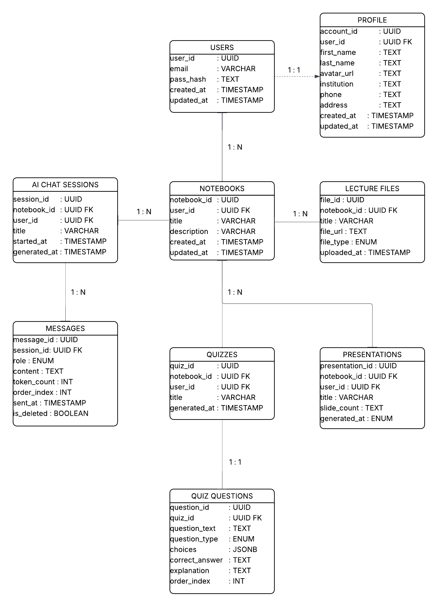

# Soft Design

# Entity Relationship Diagram

The diagram models a notebook-centric learning platform. A **User** is the root entity, holding credentials and timestamps. Each user has exactly one **Profile** (1:1) storing personal details such as name, institution, and contact info.

A user owns many **Notebooks** (1:N), which act as workspaces. Each notebook can contain:

- **Lecture Files** (1:N) — uploaded source material (PDF, video, etc.) that feeds the RAG pipeline.
- **AI Chat Sessions** (1:N) — threaded conversations scoped to a notebook, each holding many **Messages** (1:N) with role, content, token count, and soft-delete support.
- **Quizzes** (1:N) — AI-generated assessments linked to a notebook, each decomposed into **Quiz Questions** (1:N) stored with type, JSONB choices, correct answer, and explanation.
- **Presentations** (1:N) — AI-generated slide decks derived from notebook content.
